<h1 align="center">美妆购物网站，系统角色主要有：后台管理员系统【带论文】</h1>

- <b>完整代码获取地址：从戎源码网 ([https://armycodes.com/](https://armycodes.com/))</b>
- <b>技术探讨、资料分享，请加QQ群：692619798</b>
- <b>作者微信：19941326836  QQ：3645296857</b>
- <b>承接计算机毕业设计、Java毕业设计、Python毕业设计、深度学习、机器学习</b>
- <b>选题+开题报告+任务书+程序定制+安装调试+论文+答辩ppt 一条龙服务</b>
- <b>所有选题地址 ([https://github.com/Descartes007/allProject](https://github.com/Descartes007/allProject)) </b>

## 一、项目介绍

### 基于 Spring Boot + Vue 的美妆购物网站，系统角色主要有：后台管理员（管理端）、用户（会员/前端）、商家。主要功能如下：
### 管理员（后台）
- 基本：登录/退出、修改密码、获取/修改个人信息
### 商品管理：商品列表、详情、新增/编辑、删除、上/下架、审核
- 订单管理：订单列表、详情、订单状态管理（发货/收货/退款/评价 状态流转）、统计
### 用户/商家管理：用户与商家的增删改查、重置密码、会话查看
- 内容管理：新闻、论坛管理（CRUD）、评论管理、收藏管理
### 用户（会员 / 前端）
- 认证：注册、登录、登出、忘记密码/重置
- 商品浏览：商品列表、详情（点击量统计）、搜索、筛选
- 购物车：加入/修改/删除/列表
- 下单与支付：购物车下单或单品下单、支付（支持余额/积分支付逻辑）、订单查询、申请退款、确认收货
- 售后与评价：订单评价（发表评论）、查看评价
- 收藏：收藏/取消收藏、收藏列表
- 地址管理：增删改查、默认地址逻辑
- 个人中心：查看/修改个人信息、积分与等级显示
### 商家
### 认证：商家注册、登录、重置密码、会话管理
### 商品发布与管理：发布商品、编辑、上下架、审核流程（管理员审核）
### 订单处理：查看商家相关订单、发货、退款处理、统计收入（修改商家余额）

## 二、项目技术

- 编程语言：Java (后端)
- 项目架构：B/S 架构

## 三、运行环境

- JDK版本：1.8及以上都可以
- 操作系统：Windows7/10、MacOS
- 开发工具：IDEA、Ecplise、MyEclipse都可以

## 四、数据库配置文件

- npm版本：6.14.13及以上都可以
- Redis版本：3.2.100及以上都可以
- 文件名：application.yml
- 编码类型：utf8

## 论文截图

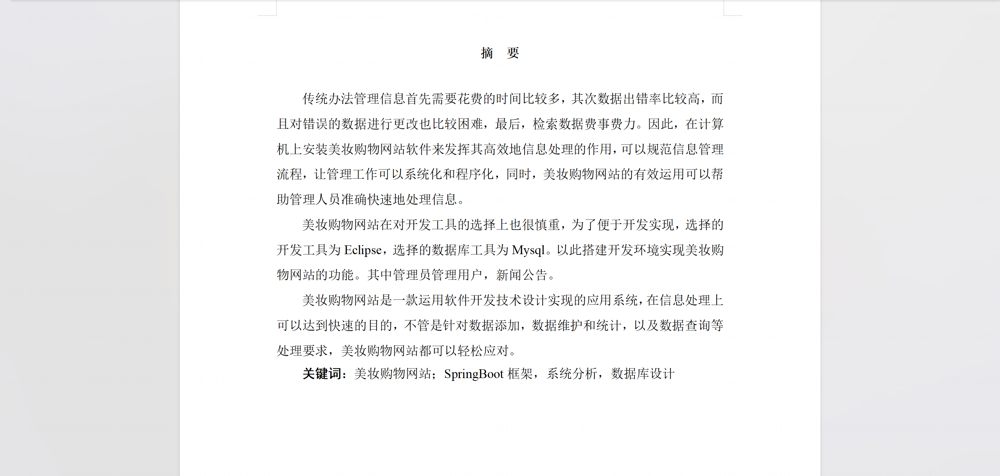

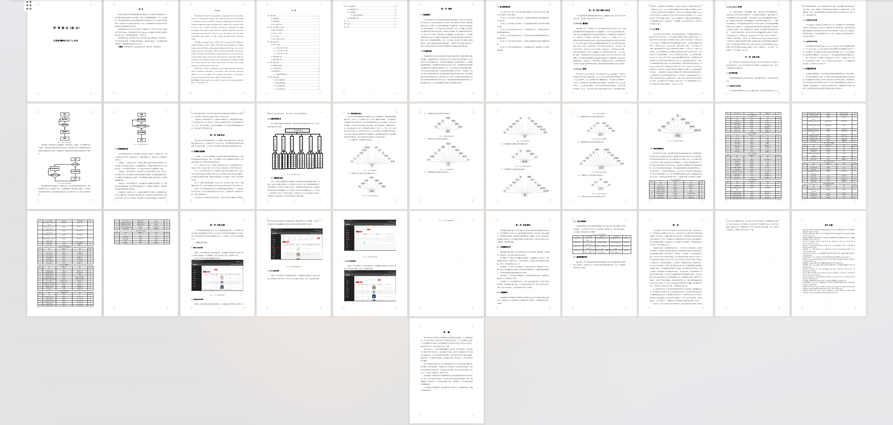

## 系统截图

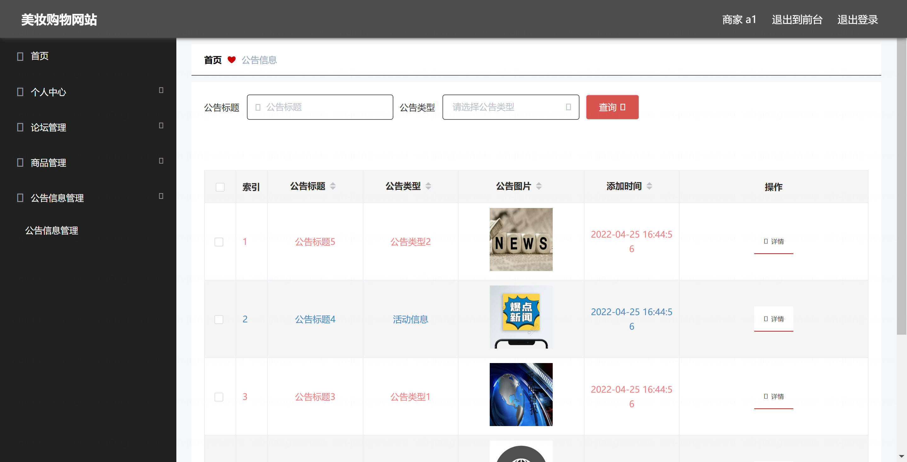

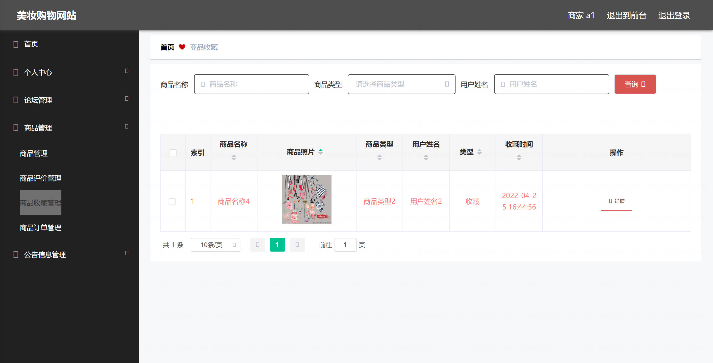

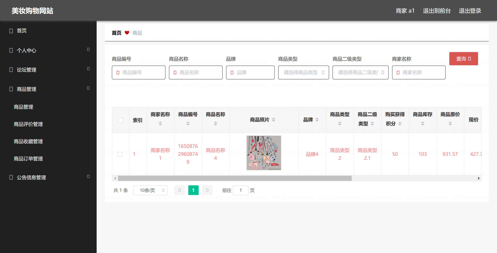

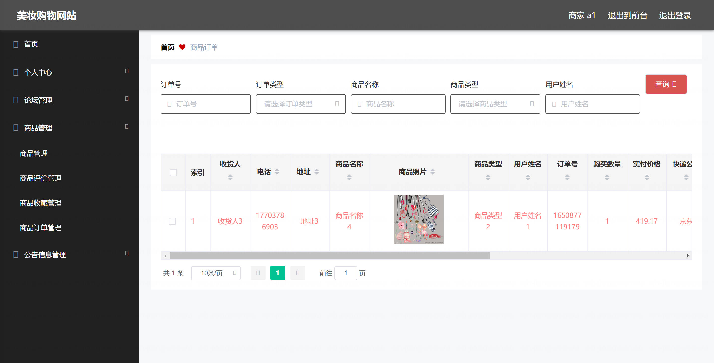

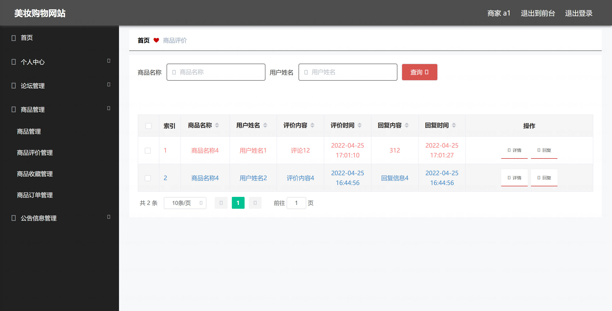

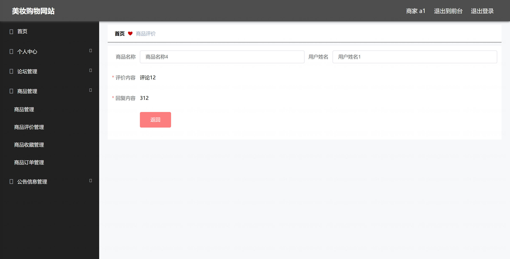

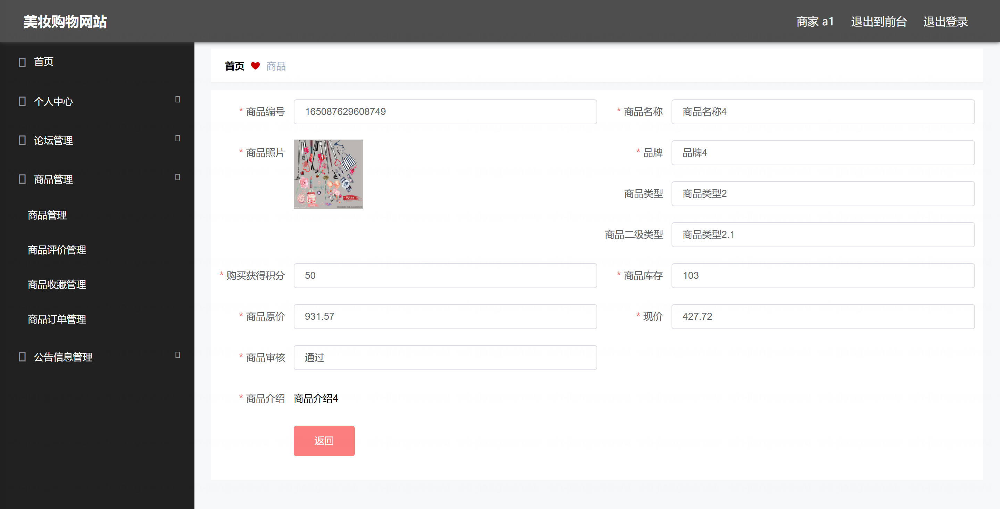

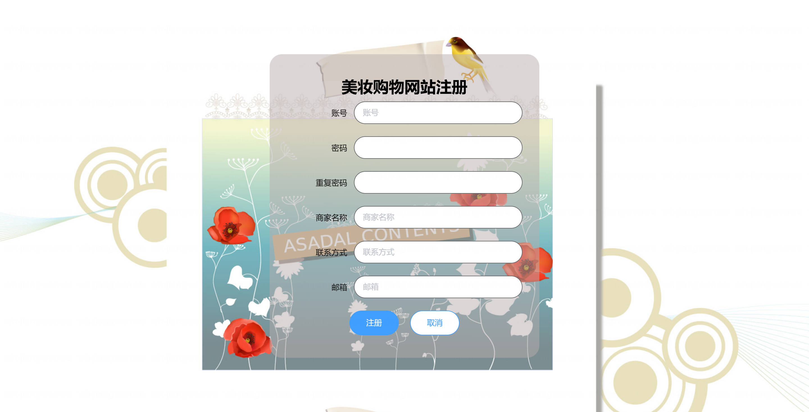

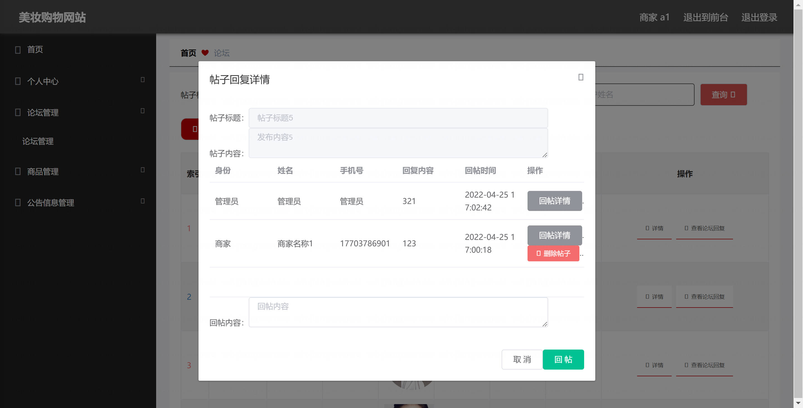

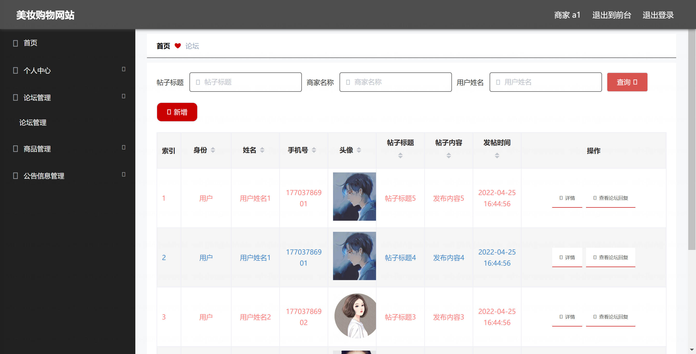